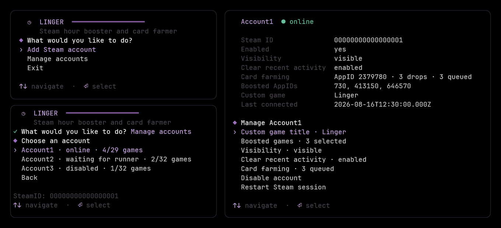

# Linger

Linger is a terminal-based, multi-account Steam hour booster and card farmer.



## Features

- Manage multiple Steam accounts through an interactive TUI
- Sign in with a Steam Mobile QR code or Steam credentials
- Use Steam passwords only during sign-in and never save them locally
- Browse and search your Steam library
- Add games manually by AppID
- Boost multiple games simultaneously
- Automatically farm available trading-card drops
- Reconnect disconnected accounts automatically
- Configure online visibility per account
- Display a custom game title
- Clear recent Steam activity
- Encrypt saved Steam session tokens with a local master key
- Apply configuration changes without restarting the runner

## Requirements

- Node.js 24 or newer
- pnpm 11

## Quick start

Install and build Linger, open the manager to add accounts, then start the runner:

```sh
pnpm install
pnpm build
pnpm manage
pnpm start
```

The manager can be opened again while the runner is active. Configuration changes are picked up automatically.

## Docker

Build the image, configure accounts, and start the service:

```sh
docker compose build
docker compose run --rm linger manage
docker compose up -d
```

Follow the runner logs with `docker compose logs -f linger`.

Compose stores `linger.sqlite` and `master.key` in the `linger-data` volume mounted at `/app/data`.

## Configuration

| Variable | Default | Description |
| --- | --- | --- |
| `LINGER_DATA_DIR` | `./data` | Directory for the database and generated master key |
| `LINGER_DB_PATH` | `<data dir>/linger.sqlite` | Override the SQLite database path |
| `LINGER_MASTER_KEY` | Generated automatically | Encryption key with at least 32 characters |
| `LINGER_MASTER_KEY_FILE` | — | Read the encryption key from a file; takes precedence over `LINGER_MASTER_KEY` |
| `LINGER_RECONCILE_INTERVAL_MS` | `2000` | How often the runner checks for account changes |

Back up the data directory or Docker volume as a unit. Deleting it removes Linger's configuration, and saved account tokens cannot be decrypted if the master key is lost.

## Operational notes

- Steam supports at most 32 simultaneous game entries. A custom title uses one slot, and recent-activity clearing reserves three. Games can still be configured using AppIDs if the library is unavailable.

- Card farming temporarily replaces normal hour boosting. When the queue finishes, boosting resumes, or the account is disabled if no normal presence is configured.

- Steam has no documented API for remaining card drops, so detection relies on Community badge markup. Ambiguous, rate-limited, or logged-out responses are retried rather than treated as zero drops.

- If an account starts playing elsewhere, Linger pauses and reconnects automatically after the game exits. Invisible accounts may take longer to detect.

## Development

```sh
pnpm check
pnpm test
```

---

<sub>Not affiliated with Valve Corporation or Steam. All trademarks belong to their respective owners. Released under the [MIT License](LICENSE).</sub>
